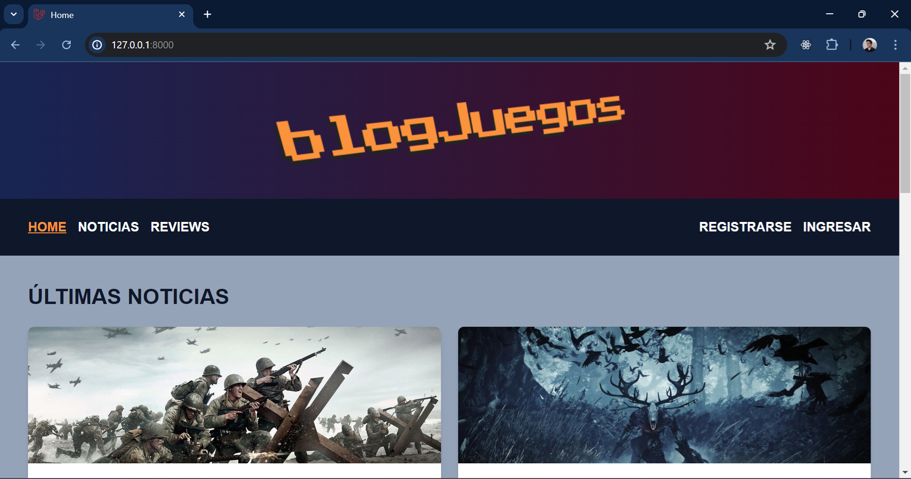
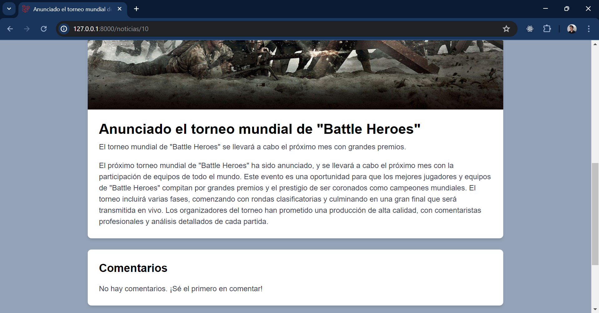
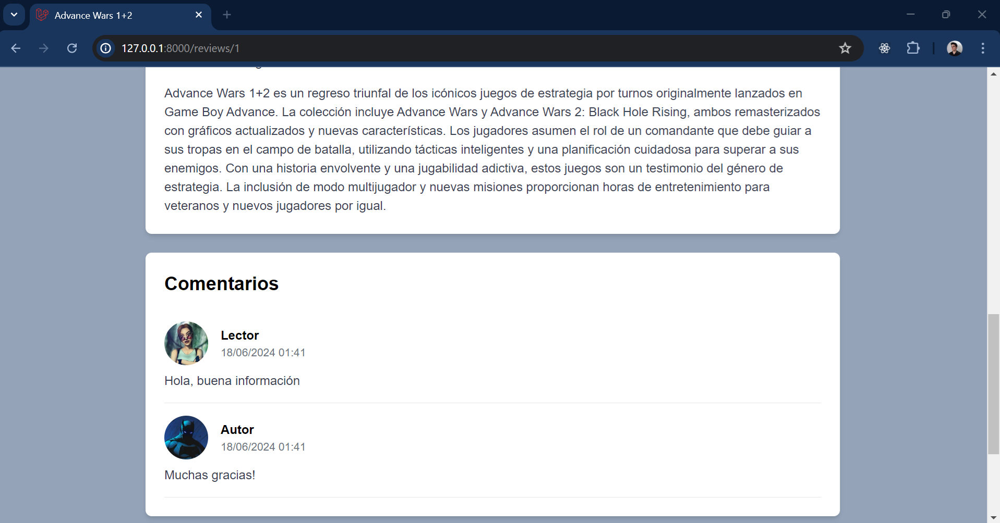
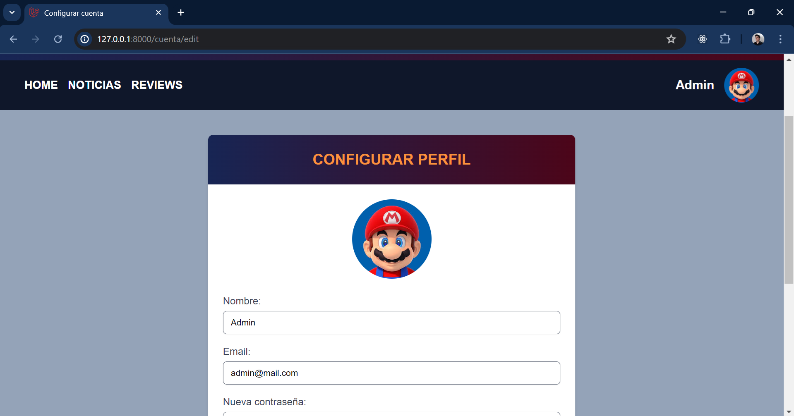
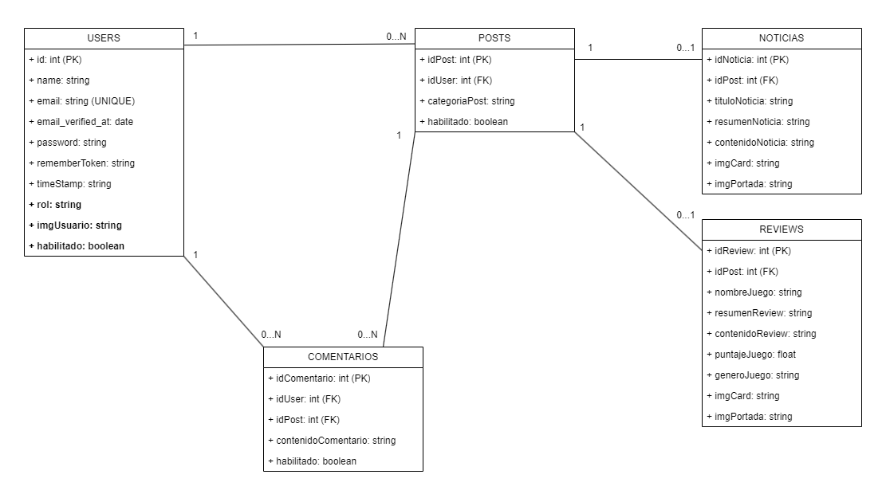

<div align="center">

Programación Web Avanzada 2024

<h3>Trabajo Práctico N°3: Laravel</h3>
Framework
<br><br>

Logo del sitio:


<br>

</div>

---

<h3>Grupo A</h3>

-   Borghese Nicolás \[FAI-997\]
-   La Forgia Floriana \[FAI-2498\]

---

<h3>Descripción de la aplicación</h3>

La aplicación corresponde al sitio web de un blog sobre videojuegos. En el sitio se pueden encontrar posts que se dividen en dos categorías, noticias sobre videojuegos y reviews. También cuenta con un sistema de login y creación de cuentas las cuales inician con el rol de lector el cual permite registrar comentarios en el sitio. Existe además el rol de autor que permite crear y editar posts. Por último está el rol de administrador que tiene todas las funcionalidades anteriores y además puede administrar los roles de las distintas cuentas de usuario.

---
<h3>Imágenes de referencia del sitio</h3>



<div align="center">
  
  
  
</div>

---

<h3>Modelo de datos</h3>



---
<h3>Guía de instalación</h3>

Para poder ejecutar este proyecto en su ordenador es necesario contar primero con las siguientes herramientas:

- <b>Un editor de código</b>, si no cuenta con ninguno recomendamos el uso de <b>Visual Studio Code</b> para Windows

<div align="center">

[Link al sitio de Visual Studio Code](https://code.visualstudio.com/)

</div>

- <b>Git</b>, un sistema de control de versiones distribuido

<div align="center">

[Link al sitio de Git](https://git-scm.com/)

</div>

- <b>Node.js</b>, un entorno de ejecución de JavaScript

<div align="center">

[Link al sitio de Node.js](https://nodejs.org/en)

</div>

- <b>PHP</b>, lenguaje de desarrollo web

<div align="center">

[Link al sitio de PHP](https://www.php.net/manual/es/install.php)

</div>

- <b>Composer</b>, herramienta de gestión de dependencias en PHP

<div align="center">

[Link al sitio de Composer](https://getcomposer.org/)

</div>

- <b>XAMPP</b>, sistema de gestión de bases de datos MySQL, servidor web Apache y los intérpretes para lenguajes de script PHP y Perl

<div align="center">

[Link al sitio de XAMPP](https://www.apachefriends.org/es/index.html)

</div>

<br>

Si ya tiene estas herramientas instaladas en su equipo entonces debe ejecutar su editor de código, abrir una nueva terminal y seguir los siguientes pasos:

<br>

1. Ubicar la terminal en el directorio deseado para instalar el proyecto y clonar el repositorio ejecutando en consola el comando:

```bash
git clone https://github.com/NicolasBorghese/blogjuegos2.git
```
2. Acceder a la carpeta donde se instalo el proyecto con el comando:

```bash
cd blogjuegos2
```
3. Instalar las dependencias de composer necesarias para el proyecto ejecutando el comando:

```bash
composer install
```

4. Instalar las dependencias de node necesarias para el proyecto ejecutando el comando:

```bash
npm install
```

5. Configurar el archivo .env (para esto se recomienda copiar el archivo <i>.env.example</i> pegarlo en la raíz del proyecto y cambiarle el nombre a <i>.env</i>):
Si se realiza el paso de la recomendación al acceder al archivo <i>.env</i> se encontrará con la configuración que tiene por defecto. En caso de que haga falta se deben modificar las variables de entorno necesarias, como la conexión a la base de datos y otras configuraciones específicas.

```bash
cp .env.example .env
```

6. Para poder utilizar las imágenes del poblamiento de datos que creamos para el proyecto (paso 10)debe copiar la carpeta <i>images</i> que se encuentra en la raíz del proyecto en la dirección storage/app/public

```bash
cp images storage/app/public/images
```

7. Generar la clave de la aplicación

```bash
php artisan key:generate
```

8. Abrir el panel de XAMPP e iniciar Apache y MySql. Luego dirigirse a http://localhost/phpmyadmin/index.php y en la solapa SQL ejecutar el siguiente comando

```bash
CREATE DATABASE blogjuegos
```

9. Migrar la base de datos:

```bash
php artisan migrate
```

10. Poblar la base de datos:

```bash
php artisan db:seed
```

11. Crear un enlace simbólico para poder acceder a las imágenes del proyecto

```bash
php artisan storage:link
```
<div align="center">

<b>Los pasos siguientes junto con abrir el panel de XAMPP e iniciar Apache y MySql serán los pasos recurrentes para ejecutar la aplicación en el navegador una vez que ya se encuentre todo configurado.</b>

</div>

12. Servir la aplicación:

```bash
php artisan serve
```

13. Compilar los recursos de front-end:

```bash
npm run dev
```

14. Ir a la siguiente dirección en el navegador para poder visualizar el sitio:

```bash
http://127.0.0.1:8000/
```

15. En caso de necesitar reestablecer la base de datos desde cero con el poblamiento por defecto se recomienda utilizar el siguiente comando:

```bash
php artisan migrate:fresh --seed
```

---
<h3>Tecnologías utilizadas</h3>

<table>
    <tr>
        <td><b>Nombre</b></td>
        <td><b>Versión</b></td>
        <td><b>Descripción</b></td>
        <td><b>Link</b></td>
    </tr>
    <tr>
        <td>Laravel</td>
        <td>11.10.0</td>
        <td>Framework PHP</td>
        <td>https://laravel.com/</td>
    </tr>
        <tr>
        <td>Tailwind</td>
        <td>3.4.4</td>
        <td>Librería de CSS</td>
        <td>https://tailwindcss.com/</td>
    </tr>
</table>

---
