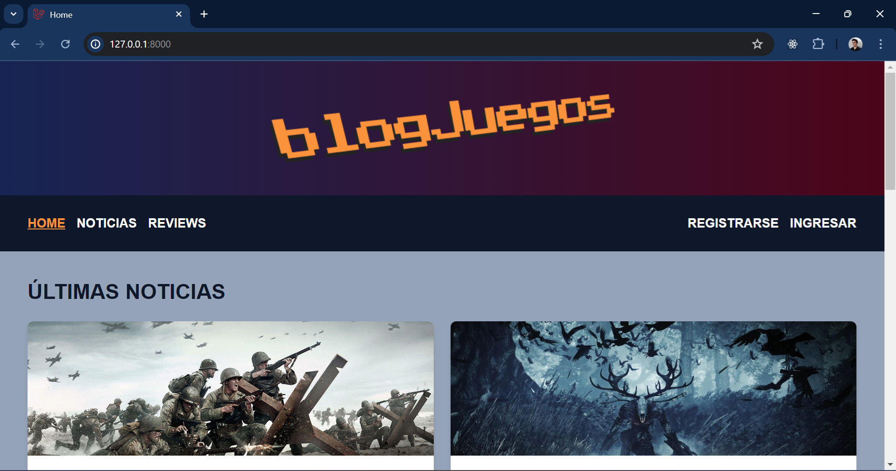
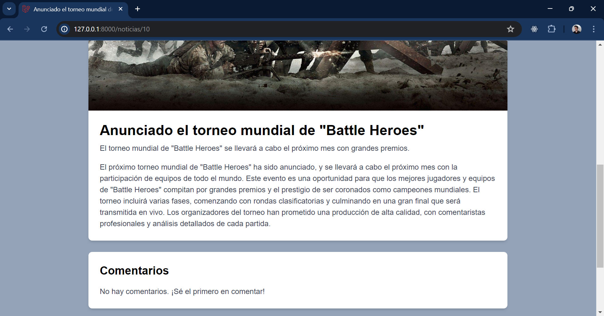
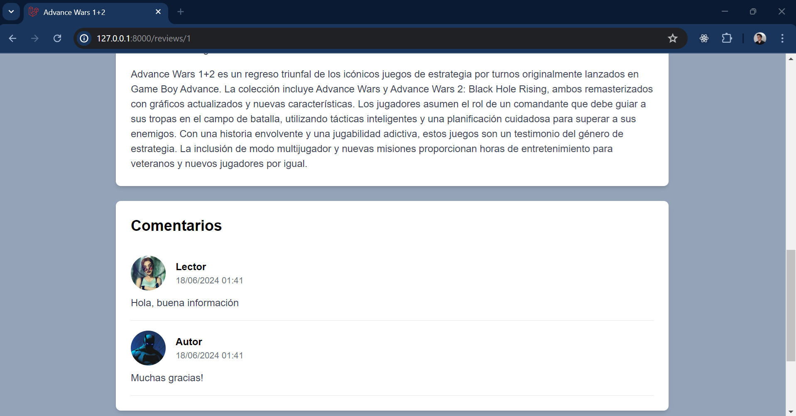
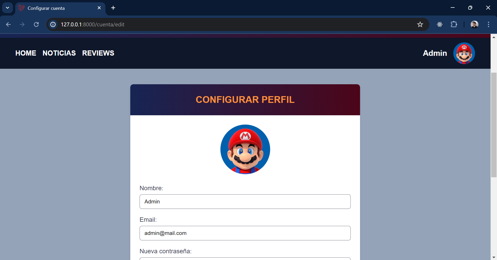
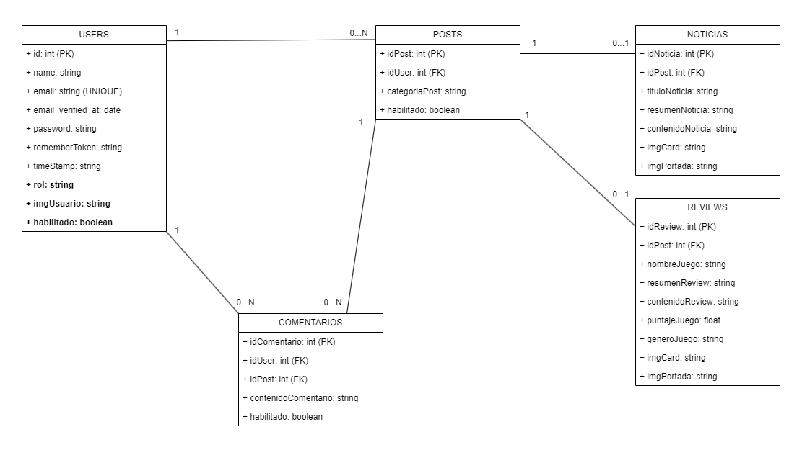

<div align="center">

Programación Web Avanzada 2024

<h3>Trabajo Práctico N°3: Laravel</h3>
Framework
<br><br>

Logo del sitio:


<br>

</div>

---

<h3>Grupo A</h3>

- Borghese Nicolas \[FAI-997\]
- La Forgia Floriana \[FAI-2498\]

---

<h3>Descripción de la aplicación</h3>

La aplicación corresponde al sitio web de un blog sobre videojuegos. En el sitio se pueden encontrar posts que se dividen en dos categorías, noticias sobre videojuegos y reviews. También cuenta con un sistema de login y creación de cuentas las cuales inician con el rol de lector el cual permite registrar comentarios en el sitio. Existe además el rol de autor que permite crear y editar posts. Por último está el rol de administrador que tiene todas las funcionalidades anteriores y además puede administrar los roles de las distintas cuentas de usuario.

---

<h3>Imágenes de referencia del sitio</h3>



<div align="center">
  
  
  
</div>

---

<h3>Modelo de datos</h3>



---

<h3>Guía de instalación</h3>

Para poder ejecutar este proyecto en su ordenador es necesario contar primero con las siguientes herramientas:

- <b>Un editor de código</b>, si no cuenta con ninguno recomendamos el uso de <b>Visual Studio Code</b> para Windows

<div align="center">

[Link al sitio de Visual Studio Code](https://code.visualstudio.com/)

</div>

- <b>Git</b>, un sistema de control de versiones distribuido

<div align="center">

[Link al sitio de Git](https://git-scm.com/)

</div>

- <b>Node.js</b>, un entorno de ejecución de JavaScript

<div align="center">

[Link al sitio de Node.js](https://nodejs.org/en)

</div>

- <b>PHP</b>, lenguaje de desarrollo web

<div align="center">

[Link al sitio de PHP](https://www.php.net/manual/es/install.php)

</div>

- <b>Composer</b>, herramienta de gestión de dependencias en PHP

<div align="center">

[Link al sitio de Composer](https://getcomposer.org/)

</div>

- <b>PostgreSQL</b>, sistema de gestión de bases de datos relacional

<div align="center">

[Link al sitio de PostgreSQL](https://www.postgresql.org/download/)

</div>

> **Importante:** PHP debe tener habilitada la extensión `pdo_pgsql`. Para verificarlo ejecutá `php -m | grep pgsql`. Si no aparece, habilitala descomentando `extension=pdo_pgsql` en tu archivo `php.ini`.

<br>

Si ya tiene estas herramientas instaladas en su equipo entonces debe ejecutar su editor de código, abrir una nueva terminal y seguir los siguientes pasos:

<br>

1. Ubicar la terminal en el directorio deseado para instalar el proyecto y clonar el repositorio ejecutando en consola el comando:

```bash
git clone https://github.com/NicolasBorghese/blogJuegos.git
```

2. Acceder a la carpeta donde se instalo el proyecto con el comando:

```bash
cd blogJuegos
```

3. Instalar las dependencias de composer necesarias para el proyecto ejecutando el comando:

```bash
composer install
```

4. Instalar las dependencias de node necesarias para el proyecto ejecutando el comando:

```bash
npm install
```

5. Configurar el archivo <i><b>.env</b></i> copiando el archivo <i><b>.env.example</b></i>:

```bash
cp .env.example .env
```

   Luego abrí el archivo `.env` y actualizá las credenciales de PostgreSQL según tu instalación local:

```
DB_CONNECTION=pgsql
DB_HOST=127.0.0.1
DB_PORT=5432
DB_DATABASE=blogjuegos
DB_USERNAME=postgres
DB_PASSWORD=tu_contraseña
```

6. Generar la clave de la aplicación:

```bash
php artisan key:generate
```

7. Crear la base de datos en PostgreSQL. Podés hacerlo desde la terminal de PostgreSQL (`psql`) o cualquier cliente como pgAdmin:

```sql
CREATE DATABASE blogjuegos;
```

8. Migrar y poblar la base de datos:

```bash
php artisan migrate --seed
```

9. Crear el enlace simbólico para acceder a las imágenes del proyecto:

```bash
php artisan storage:link
```

<br>
<div align="center">

<b>Los pasos siguientes serán los pasos recurrentes para ejecutar la aplicación en el navegador una vez que ya se encuentre todo configurado.</b>

</div>
<br>

10. Compilar los recursos de front-end (en una terminal, este comando genera un link en consola que no dirige a la aplicación):

```bash
npm run dev
```

11. Servir la aplicación (en otra terminal, este comando genera el link válido para ingresar a la aplicación):

```bash
php artisan serve
```

12. Ir a la siguiente dirección en el navegador para visualizar el sitio:

```bash
http://127.0.0.1:8000/
```

13. En caso de necesitar reestablecer la base de datos desde cero con el poblamiento por defecto:

```bash
php artisan migrate:fresh --seed
```

---

<h3>Usuarios por defecto</h3>

Al poblar la base de datos con `php artisan db:seed` se crean los siguientes usuarios:

| Nombre | Email | Contraseña | Rol |
|--------|-------|------------|-----|
| Admin | admin@mail.com | 1234 | administrador |
| Autor | autor@mail.com | 1234 | autor |
| Lector | lector@mail.com | 1234 | lector |

---

<h3>Tecnologías utilizadas</h3>

<table>
    <tr>
        <td><b>Nombre</b></td>
        <td><b>Versión</b></td>
        <td><b>Descripción</b></td>
        <td><b>Link</b></td>
    </tr>
    <tr>
        <td>Laravel</td>
        <td>11.10.0</td>
        <td>Framework PHP</td>
        <td>https://laravel.com/</td>
    </tr>
        <tr>
        <td>Tailwind</td>
        <td>3.4.4</td>
        <td>Librería de CSS</td>
        <td>https://tailwindcss.com/</td>
    </tr>
    <tr>
        <td>PostgreSQL</td>
        <td>-</td>
        <td>Base de datos relacional</td>
        <td>https://www.postgresql.org/</td>
    </tr>
    <tr>
        <td>Vite</td>
        <td>5.2.13</td>
        <td>Bundler de assets</td>
        <td>https://vitejs.dev/</td>
    </tr>
</table>

---
